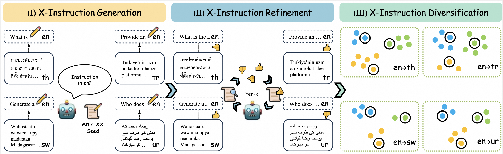
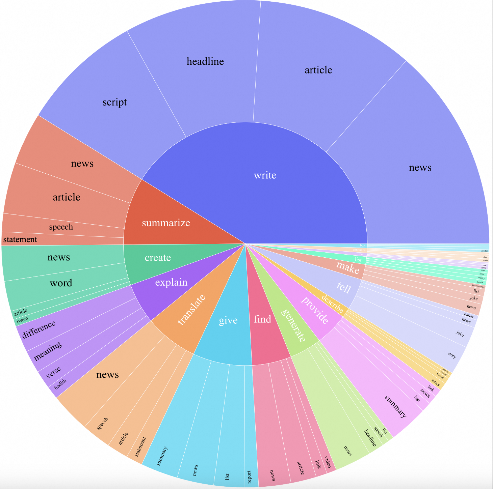

<p align="center">
  
</p>

<h1 align="center">
  X-Instruction💥
</h1>

Official code and data for ACL-2024 paper "X-Instruction: Aligning Language Model in Low-resource Languages with Self-curated Cross-lingual Instructions"

## 📢 News
🔥[May 24, 2024] We have released X-Instruction [dataset](https://huggingface.co/datasets/James-WYang/X-Instruction)
 and [models](https://huggingface.co/James-WYang/X-Instruction)
 on 🤗HuggingFace
## 📝 Case Study

**English Instruction**
> If you were a Shakespearean character, how would you declare your love for someone in a soliloquy? Answer in Tamil.

**Various models'response**

*ChatGPT*
> அன்புக்குள் அடியேனேன் விரும்புகிறேன், என் நெஞ்சின் மேல் உற்சாகம் பொருந்துகிறது. அந்த மனிதரின் இரவில் என் மனம் மூழ்கியும் மகிழ்வித்து அன்புள்ளவராய் அவரைத் துன்பம் ஏற்படுத்துவதில் என்னை துன்பப்படுத்தாது என்று தனியார் துன்பமாக அவர்களுக்கு சொல்லுகிறேன்.

> *Translate into English: Anbukhin Adiyenen, Excitement fills my bosom. I tell them in private sorrow that my mind sinks into that man's night and amuses him and makes him suffer as a loved one.*

*Bactrian*
> ங்கள் ஷேக்ஸ்பியரியன் பாத்திரத்தை அடையும் போது, ஒருவருக்கு உன்னை விரும்புகிறது என்று அறிவுறுத்தல் முக்கியம். இதன் மூலம் நீங்கள் உங்கள் உறவுக்கு மேற்பட்ட அளவில் புரிந்துகொள்ள முடியும். இது உங்கள் செயல்பாட்டில் முக்கியம் ஆகும் மற்றும் நீங்கள் உங்கள் உறவில்.

> *Translate into English: When you reach the Shakespearean role, it is important to instruct that someone loves you. This way you can understand your relationship on a higher level. This is important in your process and will help guide you in the measurements you should use in your relationship.*

*X-Instruction*
> ஒரு ஷேக்ஸ்பியர் கதாபாத்திரத்தின் அடிப்படையில், ஒரு சோலிலோக்கியில் நீங்கள் ஒருவரை காதலிக்கும் வழி, அவர்களின் உண்மையான தன்மைகளைப் பற்றி நீங்கள் பேசுவதை உள்ளடக்கியது, அவர்களின் அழகு மற்றும் ஆளுமையை நீங்கள் எவ்வாறு கண்டீர்கள் என்பதை விவரிக்கவும், மேலும் அவர்களை நேசிப்பதன் மூலம் நீங்கள் எவ்வாறு மாறியுள்ளீர்கள் என்பதை விவரிக்கவும். ஒரு எடுத்துக்காட்டு இங்கே:
> 
> ஓ, நீங்கள் எனக்கு எப்போதும் அழகானவர்கள், உங்கள் மென்மையான சிந்தனை மற்றும் உங்கள் அழகான உரையாடல் மூலம் என் இதயத்தை எந்த அளவுக்கு என்னைக் கவர்ந்து விட்டீர்கள் என்பதை நான் அறிவேன். உங்கள் சிரிப்பு மற்றும் சிரிப்பு என் மனதை உலுக்கி, நான் உன்னைத் தேடும்போது என் காதல் மிகவும் உண்மையானது. நீங்கள் என் இதயத்தை எப்போதும் துடிப்பதில் மகிழ்ச்சியடைகிறேன், மேலும் என் வாழ்க்கையில் நீங்கள் இருப்பது எனக்கு மிகவும் முக்கியமானது. உங்கள் அழகு மற்றும் ஆளுமை என் மனதை கவர்ந்துள்ளது, மேலும் நான் உன்னைக் காதலிக்கிறேன் என்பதை நான் வருந்துகிறேன்.


> Translate into English: Based on a Shakespearean character, the way you love someone in a soliloquy involves you talking about their true nature, describing how you saw their beauty and personality, and how loving them changed you. Here is an example:
> 
> Oh, you are always beautiful to me, 
> 
> I know how much you have won my heart with your gentle thoughts 
And your beautiful conversation.
> 
> Your smile and laughter shake my heart and my love is so real when I look for you. 
> 
> I am happy that you always make my heart beat
> 
> And your presence in my life is very important to me.
> 
> Your beauty and personality have captivated my heart
> 
> I regret that I am in love with you.


## 📚 Dataset
### X-Instruction Preparation
<p float="left">
    
</p>

- **X-Instruction Generation:** Language models learn to generate cross-lingual instructions for multilingual texts using seed data.
- **X-Instruction Refinement:** Language models iteratively label and refine cross-lingual instruction samples.
- **X-Instruction Diversification:** The final instruction data are sampled from different clusters of embedding from the English instruction to increase the diversity.

### Data Format
**Instruction**（*In English*）
> Is this going to be a continuous trend or not? The record-breaking temperatures around the world are becoming more common.

**Output**（*In other language*）
> लेकिन जैसे-जैसे दुननया भर में ररिॉर् ड -तोड़ तापमान बढ रहा है , हो सिता है यह लगातार न बना रहे। वुर् वेल क् लाइमेट और वाइिाटो िे शोधिताडओं ने एि तापमान सीमा िा पता लगाया है, जजसमें भववष् य में पौधों िे िाबडन अवशोवित िरने िी दर िम और िाबडन छोड़ ने िी दर तेज होगी।


### Statistic of X-Instruction
#### Overview
| Language        | Instruction Length  | Output Length        |  Samples |
| --------------- | ------------------- | -------------------- | -------- |
| Finnish (fi)    | 100.7 ± 81.1        | 1026.9 ± 552.8       | $32k$    |
| Indonesian (id) | 101.0 ± 86.0        | 1008.9 ± 542.1       | $32k$    |
| Thai (th)       | 102.4 ± 85.0        | 987.5 ± 545.0        | $32k$    |
| Turkish (tr)    | 103.7 ± 87.5        | 1057.9 ± 534.1       | $32k$    |
| Vietnamese (vi) | 101.0 ± 86.0        | 1120.4 ± 561.1       | $32k$    |
| Bengali (bn)    | 111.9 ± 87.2        | 1243.4 ± 518.7       | $32k$    |
| Hindi (hi)      | 96.6 ± 79.9         | 1284.9 ± 506.2       | $32k$    |
| Swahili (sw)    | 100.0 ± 85.3        | 1210.6 ± 524.0       | $32k$    |
| Tamil (ta)      | 99.0 ± 84.8         | 1259.0 ± 497.8       | $32k$    |
| Urdu (ur)       | 107.6 ± 87.4        | 1246.9 ± 508.8       | $32k$  

#### Topic distribution
<p float="left">
    
</p>

> The Statistic of the top 16 verbs (inner circle) and their top direct nouns (outer circle) in English instructions from X-Instruction.

## 🙋 How to get it
### Dataset
📎 X-Instruction Dataset [🤗Huggingface](https://huggingface.co/datasets/James-WYang/X-Instruction)

### Models
📎 X-Instruction Model based on Gemma-7B [🤗Huggingface](https://huggingface.co/James-WYang/X-Instruction/tree/main/gemma-7b/X-Instruction-7b-10langs) 

📎 X-Instruction Model based on Llama3-8B  [🤗Huggingface](https://huggingface.co/James-WYang/X-Instruction/tree/main/llama3-8b)

📎 X-Instruction Model based on Llama2-13B  [🤗Huggingface](https://huggingface.co/James-WYang/X-Instruction/tree/main/llama2-13b)


## 🛎 Getting Started
### 📌 Install dependencies

   ```bash
   pip install -r requirements.txt
   ```

### 📌 Model Inference
   ```bash
   bash ./scripts/inference.sh
   ```
   
### 📌 ChatGPT Generate
   ```bash
   bash ./scripts/generate.sh
   ```

### 📌 Automatic Evaluation
   ```bash
   bash ./scripts/evaluation.sh
   ```

## License

## Acknowledgement


